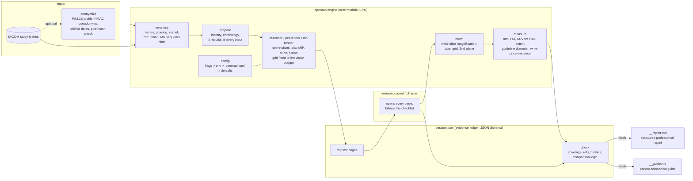

<p align="center">
  <strong>OpenRadiology</strong><br>
  <em>A deterministic DICOM workbench that lets frontier language models read CT, PET/CT and brain MRI without hallucinating.</em>
</p>

<p align="center">
  <a href="https://opensource.org/licenses/MIT"></a>
  <a href="https://python.org"></a>
  
  
  
  
  
</p>

---

## What it is

Vision-language models know a great deal of radiology, but a multi-gigabyte 3D DICOM study is not
something they can look at. They cannot decode 16-bit pixels, they lose track of which slice they are
on, they have no caliper, and when uncertain they tend to invent a plausible sentence.

OpenRadiology is the missing physical layer. It is a small, pure-Python engine
(`pydicom` + `numpy` + `scipy` + `Pillow`, no GPU, no model weights) that:

1. **Renders** every native slice of a study into labelled, orientation-marked contact sheets sized for
   the target vision model (lung/soft/bone windows, 8–10 mm slab MIP, anisotropy-correct reformats with
   a millimetre depth ruler, PET/CT fusion, MR pre/post pairs). Slices are never down-sampled; the grid
   adapts to the model's pixel budget instead.
2. **Measures** with the slice's own calibration: millimetres from `PixelSpacing`, Hounsfield units from
   the rescale tags, SUVbw from a QIBA-conformant decay chain, and reports the diameter a guideline
   expects (Fleischner average, RECIST long axis, nodal short axis). Every measurement is written once,
   hashed with SHA-256 and cited by file.
3. **Audits** the review. A session ledger (JSON Schema in `openrad/schema/`) refuses to generate a
   report unless every region and every claim points at a `SOPInstanceUID`, native `row/col` and a
   rendered page that was marked as inspected. No look, no claim.
4. **De-identifies** studies before they leave the machine: DICOM PS3.15 basic profile with
   deterministic pseudonyms, shifted dates and verified pixel integrity (`openrad anonymize`).
5. **Reports** twice from the same ledger: a structured professional report (RSNA/ESR section order,
   RadLex terms) and a plain-language patient companion guide. English by default; any other language
   with one setting, new languages by adding one locale file.

The agent layer turns this into a reproducible reading protocol: a skill file for coding agents
(`skills/openrad/SKILL.md`) and a dependency-free **Model Context Protocol server** (`openrad mcp`)
for Claude Desktop, Cursor, Windsurf, Claude Code and any other MCP client.

> OpenRadiology does not detect, segment or diagnose. It makes it impossible to *claim* without
> *looking*, and it makes every claim reproducible.

---

## Architecture



Geometry is taken from `ImagePositionPatient`/`ImageOrientationPatient` only (DICOM PS3.3 C.7.6.2):
slices are sorted along the computed normal, spacing is the measured increment, anisotropic voxels get
their own aspect ratio, gantry tilt is detected from the origin shear and either refused or de-sheared
per slice with the residual recorded. Enhanced multi-frame objects, irregular spacing and mixed
acquisition dimensions are rejected with a typed error instead of a guessed volume.

---

## Scientific grounding

Every default and every checklist item cites a guideline or a peer-reviewed source; the full table with
DOIs is in [`docs/references.md`](docs/references.md).

| Area | Standard applied | Implementation |
|---|---|---|
| Nodule detection | 8–10 mm sliding-slab MIP (Kawel 2009; Jankowski 2019) | `openrad ct-render --mip 10` |
| Nodule measurement | Fleischner measurement statement (Bankier 2017): thin section, long + perpendicular short axis, average for < 10 mm | `openrad measure --auto --lesion-type`, `measure.convention` |
| Incidental nodules, screening | Fleischner 2017 (MacMahon); ACR Lung-RADS v2022 | checklist; never auto-assigned |
| Tumour response | RECIST 1.1 (Eisenhauer 2009): node short axis 15/10 mm, lesion ≥ 10 mm | measurement conventions |
| Mediastinal nodes | IASLC map (Rusch 2009), TNM 9th ed. N2a/N2b (2025) | station table in `checklists/ct_thorax_checklist.md` |
| FDG PET quantitation | EANM v2.0/v3.0 (Boellaard 2015/2025); QIBA SUV pseudo-code; PERCIST 1.0 (Wahl 2009) | `openrad/suv.py`: START/ADMIN decay, `DecayCorrectionDateTime`, Philips CNTS, SUL |
| Brain metastases | Kaufmann 2020 protocol; RANO-BM (Lin 2015); RANO 2.0 | `checklists/brain_mri_checklist.md` |
| De-identification | DICOM PS3.15 Annex E basic profile + options 113105/113107/113108/113111 | `openrad anonymize` |
| Structured reporting | RSNA RadReport section order, RadLex lexicon, ESR statement | `openrad finish`, `templates/` |
| Peer review of AI reads | RADPEER-style scoring | `checklists/blind_audit_rubric.md` |

---

## Installation

```bash
git clone https://github.com/yusirdemir/OpenRadiology.git
cd OpenRadiology
python -m venv .venv && source .venv/bin/activate
pip install -e .            # engine + CLI
pip install -e ".[codecs]"  # add JPEG 2000 / JPEG-LS decoders for compressed exports
pip install -e ".[dev]"     # pytest, ruff, mypy
openrad doctor              # verifies interpreter, decoders, config and writable paths
```

Requirements: Python 3.9+, `pydicom ≥ 2.4`, `numpy ≥ 1.22`, `scipy ≥ 1.9`, `Pillow ≥ 9.1` (`tomli` on Python < 3.11).
Runs on macOS, Linux and Windows on a laptop; a 600-slice thin-section chest CT renders in seconds.
Without installing: `python -m openrad <command>` from the repository root works as well.

---

## Configuration

One mechanism, four layers, highest first: **flags > `OPENRAD_*` environment > project file
(`.openrad.toml`, or `[tool.openrad]` in `pyproject.toml`) > user file
(`~/.config/openrad/config.toml`) > defaults**. `openrad config` prints every effective value with its
source; `openrad config --init` writes a commented template.

```toml
# .openrad.toml
[general]
lang = "en"                 # English is the default; any openrad/locales/<lang>.json can be selected

[paths]
output_dir = "reports/radiology"

[render]
vision_profile = "claude"   # claude 1568 | gpt 2048 | gemini 3072 | local 1024 | custom (+ max_side)
grid = "3x3"                # or 2x2 (detail), auto (largest that fits)
mip_mm = 10.0

[measure]
convention = "fleischner"   # or recist

[privacy]
redact_identifiers = true   # inventories never carry PatientID / Accession / Institution
```

| Section | Keys | Why it is exposed |
|---|---|---|
| `general` | `lang`, `log_level` | institutional language (any locale file); diagnostics verbosity on stderr |
| `paths` | `studies_root`, `cache_dir`, `output_dir`, `identity_index` | archives, scratch evidence and reports usually live on different volumes with different retention |
| `render` | `vision_profile`, `max_side`, `grid`, `mip_mm`, `step_mm`, `windows` | the vision model's pixel budget, systematic-read defaults, extra window presets |
| `measure` | `convention`, `region_radius_mm` | which single diameter a guideline expects; region-growing leash |
| `pet` | `suv_threshold`, `suv_display_max`, `uptake_window_min` | detection aid, display scale, when to warn about uptake time |
| `privacy` | `redact_identifiers`, `pseudonym_salt`, `date_shift_days` | HIPAA/GDPR/KVKK-by-default; the salt is a secret, set it as `OPENRAD_PSEUDONYM_SALT` |
| `compute` | `threads` | caps BLAS/OpenMP threads on shared workstations |

Every key is also an environment variable (`OPENRAD_LANG`, `OPENRAD_GRID`, `OPENRAD_MAX_SIDE`,
`OPENRAD_OUTPUT_DIR`, `OPENRAD_CONVENTION`, `OPENRAD_REDACT_IDENTIFIERS`, `OPENRAD_THREADS`, …) and
`openrad --config FILE <command>` selects a file explicitly.

---

## Rendering for vision models

A native slice is never resampled. The sheet grid is fitted to the model's longest-edge budget:

| Budget (`max_side`) | 512-px matrix | 768-px matrix | Use |
|---|---|---|---|
| 1568 (Claude) | 3x3 = 1542 px (9 slices) or 2x2 = 1028 px | 2x2 = 1540 px | systematic scan vs detail pass |
| 2048 (GPT) | 3x3 (4x4 would need 2056) | 2x2 | |
| 3072 (Gemini) | 5x5 = 2570 px | 3x3 | |
| 1024 (local models) | 1x1 or 2x2 = 1028 → 1x1 | 1x1 | |

If a requested grid does not fit, the engine shrinks it and says so on stderr (`--grid auto` picks the
largest). Fonts scale with tile size (about 1/32 of the tile side, 11–22 px), every tile has a scale bar
sized to a fifth of its width (10/20/50/100 mm), reformats carry a z ruler with labelled 50 mm ticks, and
orientation letters come from the direction cosines.

---

## CLI guide

`stdout` carries data (paths, tables, JSON); `stderr` carries progress and errors. Exit codes are
stable so scripts and agents can branch on them.

| Exit | Meaning |
|---|---|
| 0 | success |
| 2 | usage / argument / configuration error |
| 3 | input error (folder, DICOM, ambiguous series, write-once file exists, non-empty output) |
| 4 | unsupported geometry (tilt without `--allow-tilt`, gaps, multi-frame, non-axial) |
| 5 | session validation failed (`openrad check`) |
| 6 | quantitation unavailable (SUV factor, HU calibration) |
| 7 | integrity violation (lock replaced, hash mismatch, pixel data changed) |

```bash
# 0. environment and settings
openrad doctor [--json]
openrad config [--json] | openrad config --init

# 1. (optional) de-identify before anything leaves the machine
export OPENRAD_PSEUDONYM_SALT='long-secret-kept-outside-the-repo'
openrad anonymize /archive/patient_x /export/patient_x_deid --json

# 2. inspect and open a session
openrad inventory /path/to/study --output ./work/inventory [--json]
openrad prepare study_2026_03 --repo . [--lang tr] [--studies-root DIR]

# 3. render systematic sheets
openrad ct-render /path/to/study --series 4 --windows lung --mip 10 --mpr --grid 3x3 --output ./work/lung
openrad ct-render /path/to/study --series 3 --windows soft,bone --mpr --grid 2x2 --output ./work/soft
openrad pet-render /path/to/study --pt 5 --ct 2 --weight 73 --output ./work/pet
openrad mr-render /path/to/study --pair 6 16 --step 1 --output ./work/mr

# 4. look closer and measure
openrad zoom /path/to/study --series 4 --instance 116 --center 330,150 --context 2 --scale 4 --output ./work/zoom/n1.png
openrad zoom /path/to/study --series 4 --instance 116 --center 330,150 --plane cor --output ./work/zoom/n1_cor.png
openrad measure /path/to/study --series 4 --instance 116 --points 312,240 325,252 --output ./work/meas/n1.txt
openrad measure /path/to/study --series 4 --instance 116 --auto 318,246 --lesion-type nodule --json
openrad measure /path/to/study --series 5 --instance 700 --roi 100,98,3 --weight 73

# 5. audit and finish
openrad register ./work/session.json --directory ./work
openrad check    ./work/session.json --json
openrad finish   ./work/session.json [--lang en|tr] [--output-dir ./reports]
```

`--output` measurement files are write-once; the command prints `sha256=<hash>` on stderr and drops a
`.sha256` sidecar so the value can be cited in the ledger.

---

## De-identification

`openrad anonymize IN OUT --salt SECRET` implements the DICOM PS3.15 Basic Application Confidentiality
Profile with the options a quantitative review needs:

* **Consistent pseudonyms**: UIDs (`2.25.<HMAC>`), patient ID (`OR-…`) and name (`ANON^…`) derive from
  `HMAC-SHA256(salt, value)`. The same salt maps the same patient and objects identically across exports
  and runs, so follow-up studies still line up without a lookup table.
* **Modified dates (113107)**: all dates shift by one salt-derived (or configured) number of days; times
  are kept, so uptake intervals and study order survive. `--remove-dates` applies the strict profile.
* **Patient characteristics (113108)**: sex, age, weight, height stay because SUV needs them
  (`--no-retain-characteristics` removes them).
* **Safe private tags (113111)**: only the Philips PET scale factors survive; every other private
  element, overlay and curve is dropped.
* **Descriptors (113105, partial)**: series/protocol/study descriptions are kept for sequence
  identification but emptied when they mention the patient's name/ID; `--strip-descriptors` removes them.
* Pixel data are hashed before and after; output folders and file names contain only pseudonyms;
  `BurnedInAnnotation = YES` objects are refused unless `--allow-burned-in`; a re-identification map is
  written only with `--map` and must be protected like the salt.

---

## MCP server (Claude Desktop, Cursor, Windsurf, Claude Code)

```bash
openrad mcp --install claude-desktop --write --repo ~/radiology-workspace   # then restart the client
openrad mcp --print --client cursor                                         # or print the snippet
```

The server exposes 21 tools, a clinical resource set and four prompts over stdio without any
third-party dependency. What makes it more than a wrapper:

* **`page_view` is the only way to mark a page reviewed.** It returns the sheet as an image block and
  flips the flag in the same step, after checking the file hash. The model cannot claim coverage for
  a page it never received; `session_check` refuses to finish otherwise.
* **Object-scoped feedback.** Writing a region or a claim returns just the unmet requirements for that
  object, while the image is still in context.
* **Technical alerts, never diagnoses.** `session_status` flags tilt, unsupported series, SUV warnings,
  unrendered or unviewed slices and pending comparison verdicts.
* **Hashed evidence.** `measure` writes a write-once JSON evidence file inside the session and returns
  its SHA-256 plus a ready `measurement_template` for the claim.
* **Vision-budget images.** Renders come back as a few inline PNGs plus `resource_link`s; nothing is
  down-sampled; engine progress streams as MCP logging notifications.
* **Same code as the CLI.** Every tool builds an `openrad` argv and runs it in-process with stdout
  captured, so the model and the shell always see identical results.

Full guide: [`docs/mcp.md`](docs/mcp.md).

## Agent integration (skill file)

The skill is defined once in [`skills/openrad/SKILL.md`](skills/openrad/SKILL.md) and linked into the
locations each agent expects:

| Agent | Location | Invocation |
|---|---|---|
| Claude Code | `.claude/skills/openrad` | `/openrad <study_folder> [<study_folder_2> ...]` |
| OpenAI Codex | `.codex/skills/openrad` (+ `agents/openai.yaml`) | `$openrad <study_folder>` |
| Google Antigravity | `.agents/skills/openrad` | `/openrad <study_folder>` |
| Cursor | `.cursor/rules/openrad.mdc` | rule attaches when DICOM/session/config files are in context |
| Claude Desktop, Windsurf, other MCP clients | `openrad mcp --install <client> --write` | tools, resources and prompts over MCP (see above) |
| Any other agent | give it `SKILL.md` and shell access | follow the seven steps |

What the skill enforces:

* **Three rules**: no look, no claim; every statement carries UIDs + row/col + inspected page; numbers
  come only from `openrad measure` evidence files.
* **Per-modality checklists** (thoracic CT with IASLC stations, PET/CT with physiologic-uptake
  catalogue, brain MRI with protocol adequacy table) that must be walked region by region.
* **Coverage passes**: the renderer records the `SOPInstanceUID` behind every tile; `openrad check`
  proves that every slice of every read series appeared on a page marked as reviewed.
* **Comparison discipline**: interval-change verdicts need evidence at both endpoints; chronology comes
  from headers, never from folder names.
* **Machine contract**: `openrad/schema/session.schema.json` describes the ledger the agent edits.

Works with frontier APIs (Claude, GPT, Gemini) or with local vision models through Ollama, vLLM or
LM Studio; the images never have to leave the machine.

---

## Output

Two Markdown files from one ledger (`__report.md` / `__guide.md` in English; other locales define their
own suffixes in `openrad/locales/<lang>.json`), written to `reports/` by default:

* **Professional report** — banner, examinations and clinical information, technique and comparison,
  findings by region, impression with measurements, change over time, recommendations, limitations,
  image sources (UIDs + coordinates) and the SHA-256 fingerprint of all inputs.
* **Patient guide** — how to read this document, what was examined, what each key result means
  (term, importance, uncertainty, what to ask), every region explained, how to understand the comparison,
  a consolidated list of questions for the physician, what the review cannot tell, glossary.

Machine evidence (`session.json`, `evidence.json`, render index, measurement logs) stays in the ignored
run cache so that nothing but the two documents reaches the archive.

---

## Repository layout

```
openrad/            engine and CLI: dcmlib, grid, suv, measure, renderers, anonymize, config, create_report, errors
openrad/schema/     JSON Schema of the session ledger
openrad/locales/    report strings per language (en.json, tr.json, ...)
openrad/mcp/        Model Context Protocol server: protocol core, tools, resources, prompts, client installer
skills/openrad/     agent skill (SKILL.md) + OpenAI agent manifest
checklists/         modality checklists, lessons learned, blinded-audit rubric
templates/<lang>/   report + evidence specification and patient-guide language rules per locale
docs/references.md  guidelines and papers with DOIs, mapped to code
docs/mcp.md         MCP server guide
tests/              synthetic-phantom engineering tests (no patient data)
```

---

## Testing and privacy

```bash
pytest                          # or: python3 tests/test_pipeline.py && python3 tests/test_mcp.py
ruff check .
```

Fifty-four synthetic tests cover geometry and tilt, grid fitting, configuration precedence, SUV decay
paths, measurement conventions, de-identification, hashing, validation, exit codes and the MCP layer
(handshake, tool catalogue, a complete review session over JSON-RPC, resources, prompts, stdio
transport, client installers). Tests use
phantoms generated in code. The repository must never contain DICOM files, rendered sheets, session JSON
or reports derived from real examinations, even anonymized ones; `.gitignore` excludes `DCIM/`,
`reports/` and `.cache/` by default. See [CONTRIBUTING.md](CONTRIBUTING.md).

---

## Limitations

* Reformats and PET fusion require canonical axial LPS stacks; oblique or feet-first acquisitions are
  rejected rather than silently flipped.
* Enhanced multi-frame CT/MR/PET objects are not decoded.
* No registration between studies: comparisons are by patient coordinates and visual matching.
* Region growing is an exploratory caliper aid, not segmentation.
* De-identification cannot detect burned-in pixel text; review the images.
* Engineering tests prove invariants, not clinical sensitivity. Any clinical validation must be done
  prospectively with independent adjudication.

---

## Safety and medical disclaimer

OpenRadiology is an AI-assisted decision-support, research and educational tool. **It does not provide
medical diagnoses.** A negative AI review never excludes disease. All findings, measurements and
impressions must be reviewed by a board-certified radiologist and the treating physician before any
clinical decision. The software is provided "as is" without warranty of any kind (see [LICENSE](LICENSE)).

---

## Citation and license

If you use OpenRadiology in research, cite it via [`CITATION.cff`](CITATION.cff). Distributed under
the MIT License. Guideline content remains the property of the respective societies and is cited, not
reproduced.

### Experimental KROMA-3D lesion passports

```bash
openrad passport STUDY_DIR --output OUT_DIR
openrad passport STUDY_DIR --series 4 --output OUT_DIR --max-candidates 32 --detail-cards --json
```

`passport` creates a 1024×1024 depth-coloured coronal overview, one or two
1024×1024 passport sheets (16 candidates each), and `passport.json`. A single
CT series is selected automatically; multiple CT series require `--series`.
Only regular, canonical axial CT stacks with HU rescale metadata are accepted.
The output directory must be new or empty. JSON includes zero-based isotropic
and fractional source `(z,y,x)` coordinates, patient LPS millimetres, nearest
source SOP UID, scores, selected filter scale, image/card locations and warnings.
It contains source UIDs for traceability; this command is **not de-identification**.

The Python API `openrad.kroma.create_passport(volume_hu, output_path,
spacing_zyx=(1,1,1), origin_lps=(0,0,0))` also accepts synthetic arrays.
It uses centre-aligned linear resampling to exactly 1 mm, enclosed-air lung
masking, and scale-normalized 3D Gaussian Hessians at 1, 1.5, 2.2, 3.3 and 5 mm.
Separable convolutions share intermediate derivatives, with support-sized halos
and vectorized symmetric eigensolvers operating only on mask voxels in bounded
blocks. Truncated second-derivative kernels reject constant intensity. Float32
feature maxima are merged in place across scales, and normalization is global,
so changing block boundaries does not change scores. Vessel suppression shifts
HU by the lung-window floor before multiplying, avoiding brightening negative HU.
Frangi scores retain their native dimensionless range, with bright-object sign
gating; blob scores are normalized by the largest response in the volume.

`--block-size` (default 64) controls convolution working memory;
`--memory-mb` (default 4096 MiB) rejects estimated array allocations over budget.
This is a conservative array estimate, **not a process RSS limit**; DICOM decoder,
Python and numerical-library overhead need additional memory. Source voxels and
three feature volumes remain in memory; no full-volume Hessian is retained.
Candidate extraction uses 5-voxel maxima, deterministic plateau suppression and
a bounded shortlist; `--tau` defaults to 0.25 and `--gamma` to 2.

Each candidate shows axial, coronal and sagittal planes over a 48 mm FOV, with
red blob / green vessel overlays and the underlying HU window in blue. Sheet
cards use **2×** nearest-neighbour magnification, in two columns and eight rows.
Sixteen 48 mm, three-plane cards at 3× cannot fit a 1024×1024 sheet;
`--detail-cards` additionally exports separate **3×** PNG cards. The OCR badge's
`~mm` value is a **winning-filter-scale equivalent sphere estimate**, not a
segmented or clinically measured diameter. HU is the centre voxel value.

These are experimental candidate summaries, not a diagnosis or exhaustive review
and they do not mark session coverage as reviewed. The mask can exclude pleural
or opaque lesions and include other air cavities; 1 mm resampling, projection,
thresholds and the candidate cap can omit lesions. Zero candidates does not mean
normal imaging. Colour overlays can saturate. A single winning-depth MIP cannot
preserve every superposed lesion or guarantee rainbow vessel trajectories.
Synthetic tests establish engineering behaviour only: there is no demonstrated
1 mm sensitivity guarantee, model diagnostic equivalence or measured token saving.

All six processing controls also follow the existing configuration precedence:
CLI > `OPENRAD_KROMA_*` environment > TOML `[kroma]` > defaults. For example,
`OPENRAD_KROMA_MEMORY_MB=2048` or `[kroma] kroma_memory_mb = 2048` sets the memory
guard. The other keys are `kroma_max_candidates`, `kroma_tau`, `kroma_gamma`,
`kroma_c_hu` (`--c-hu`, default 50 HU) and `kroma_block_size`.
